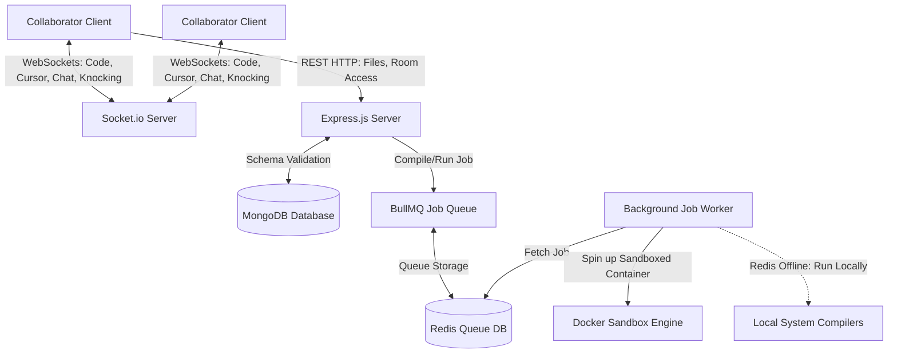

# Co-Lab IDE — Distributed Cloud-Native Code Engine & Real-Time Collaborative Workspace

Co-Lab IDE is a high-performance, distributed, and cloud-native collaborative development workspace. It enables multiple developers to create multi-file workspaces, chat, share screens via synchronized cursors, write code with smart boilerplates, and compile/execute programs in isolated environments.

Built using **React, TypeScript, Monaco Editor, Express, Socket.io, Redis, BullMQ, and Docker**, it is engineered with a hybrid compilation pipeline that supports queue-based sandbox container execution and falls back gracefully to local execution runtimes.

---

## 🚀 Key Architectural Features

### 1. 🔒 Secure Admission (Knocking) Flow & Access Gates
To protect active collaborative rooms:
* **API Shielding**: Access is locked down. Uninvited guests are restricted from viewing sandbox files or passwords.
* **Knocking Handshake**: Guests landing on a collaboration URL enter a modern glassmorphic "Awaiting Admission" state and send a join request.
* **Host Gatekeeper UI**: The room host receives an interactive floating notification banner at the top-right to **Accept** or **Reject** the join request. On approval, keys are exchanged, and the guest enters the live workspace.

### 2. 🎨 Smart Customized Boilerplate Injection
* Populates clean template headers and boilerplates for **JavaScript, Python, Java, C, and C++** upon switching languages or creating new workspace files.
* *Smart Guard*: Checks if the file is empty or untouched, ensuring it never overwrites a user's custom progress.

### 3. ⚡ Cloud-Native Execution Engine (Hybrid Queue)
* **High Throughput**: Code execution requests are sent to a **BullMQ** job queue backed by **Redis**.
* **Sandboxed Security**: Tasks are picked up by workers and executed inside isolated, resource-constrained **Docker containers** (Node, OpenJDK, GCC, Python).
* **Native In-Process Fallback**: If Redis or Docker is offline, the backend compiler falls back to native process execution utilizing local environment compilers (using `child_process` and temp files), ensuring zero-downtime execution.

### 4. 📂 Multi-File Real-Time Workspace
* Support for creating, renaming, and deleting files inside a collaborative workspace.
* Real-time file sync, file-active indicators showing who is viewing which file, and dynamic caret cursors showing exactly where other collaborators are writing.

---

## 🛠️ Technology Stack

* **Frontend**: React.js, Vite, TypeScript, TailwindCSS, Monaco Editor, Framer Motion, Redux Toolkit
* **Real-time Synchronization**: Socket.io (WebSockets)
* **Backend API**: Node.js, Express, TypeScript, Mongoose, MongoDB
* **Orchestration & Queueing**: Redis, BullMQ
* **Sandbox Execution**: Docker, Dockerode (Docker API client for Node)
* **CI/CD**: Jenkins, Docker Compose

---

## 📐 System Architecture Diagram



---

## 📦 Local Setup & Installation

### Prerequisites
* **Node.js** (v18 or higher)
* **MongoDB** (Running locally on default port `27017`)
* **Redis** (Optional: fallbacks to local execution if Redis is offline)

### Step 1: Clone and Configure Environment

1. **Frontend Configuration** (`client/.env.development`):
   ```env
   VITE_BASE_URL = http://localhost:8000/api/v1/
   VITE_SOCKET_URL = http://localhost:3001
   ```

2. **Backend Configuration** (`server/.env`):
   ```env
   PORT = 8000
   MONGO_URI = mongodb://127.0.0.1:27017/colab
   CORS_ORIGIN = *
   JWT_SECRET = dev-secure-jwt-secret-key-12345
   ENV = dev
   ```

### Step 2: Run Services in Parallel

Start each service in a separate terminal:

1. **Socket Server**:
   ```bash
   cd socket
   npm install
   npm run dev
   ```

2. **Backend Express Server**:
   ```bash
   cd server
   npm install
   npm run dev
   ```

3. **Frontend Client**:
   ```bash
   cd client
   npm install
   npm run dev
   ```

Open [http://localhost:5173/](http://localhost:5173/) to launch the workspace!

---

## 🐳 Docker Compose Deployment (Single Command)

We have provided a complete Docker Compose file to build and orchestrate all services in production mode.

1. Install Docker & Docker Compose on your server.
2. In the project root, build and run the services:
   ```bash
   docker-compose up --build -d
   ```
This containerizes MongoDB, Redis, the Express Server (with isolated Docker support), the Socket Server, and compiles the static Vite React app for high performance.
